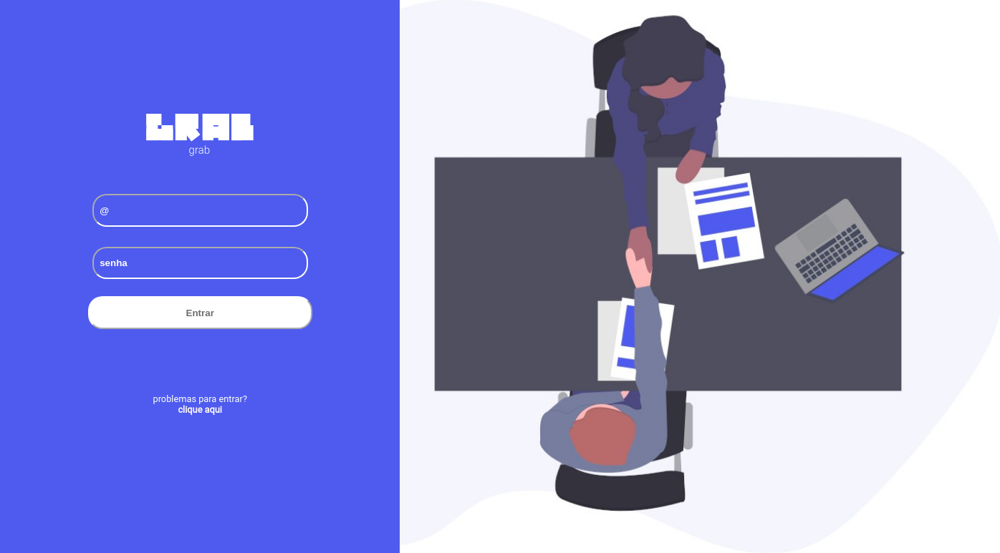

  
  <h3 align="center">Grab - Página de login</h3>

  <a href="https://github.com/magdielndantas/grab-pagina-de-login">Desafio</a>

## DevChallenge
[DevChallenge](https://devchallenge.com.br/) permite que você evolua suas skills como programador!

## Desafio
Desafio de criar uma página de login feito com sucesso.

## Tecnologias
HTML

CSS

Javascript

### Cores
Azul: #4E5BEE

Vermelho: #FF5757

Cinza: #F8F8F8

### Fonte
[Roboto](https://fonts.google.com/specimen/Roboto)

## Icones
[Material Icons(outline)](https://material.io/resources/icons/?style=outline)

## Criador

Desafio criado por [Magdiel Dantas](https://github.com/magdielndantas)
